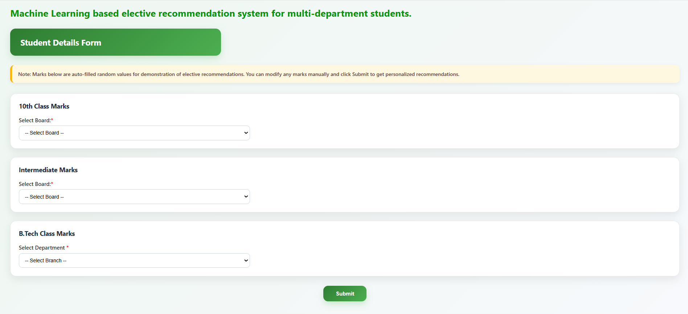
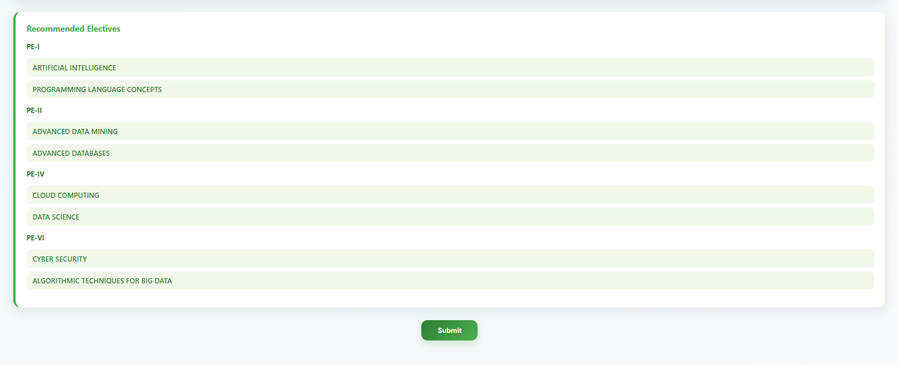

# ML-Based Multi-Department Elective Course Recommendation System

A machine-learning-based elective recommendation system for engineering students across CSE, ECE, MECH, CIVIL, and EEE departments.

## Overview

This project recommends professional elective courses based on student academic performance. The system takes subject-wise marks, extracts academic feature scores, and predicts suitable electives using a machine learning model.

## Features

- Multi-department support: CSE, ECE, MECH, CIVIL, EEE
- Professional elective recommendations from PE-I to PE-VIII
- Random Forest based machine learning model
- Hybrid ranking using ML probability and category-based scoring
- Editable subject names and marks
- Add-subject option for flexible input
- Professional Flask web interface

## Algorithm Used

The system uses a hybrid recommendation approach:

1. Random Forest Classifier  
2. Category-based fallback ranking  

The Random Forest model predicts elective suitability based on extracted academic features such as:

- Mathematics score
- Programming score
- Electronics score
- Mechanical score
- Civil score
- Department

## Tech Stack

- Python
- Flask
- Pandas
- Scikit-learn
- Joblib
- HTML
- CSS
- JavaScript

## Project Structure

```text
elective-course-recommendation/
│
├── app.py
├── train_model.py
├── requirements.txt
├── README.md
│
├── data/
│   ├── multidept_dataset.csv
│   └── electives_dataset.csv
│
├── model/
│   └── elective_rf_model.joblib
│
└── templates/
    └── index.html
## How to Run

**Install dependencies**

```bash
pip install -r requirements.txt
```

**Train the model**

```bash
python train_model.py
```

**Run the Flask app**

```bash
python app.py
```

**Open in browser**

```text
http://127.0.0.1:5000
```

---

## Output

The system displays recommended electives grouped by professional elective categories such as:
PE-I
Recommended Elective 1
Recommended Elective 2

PE-II
Recommended Elective 1
Recommended Elective 2

## Demo Note

Marks in the form are auto-filled with random sample values for demonstration.

Users can edit the marks and submit again to generate personalized recommendations.
## Screenshots

### Home Interface


### Recommendation Output


## System Architecture

Student Marks Input  
      ↓  
Feature Extraction  
      ↓  
Random Forest Prediction  
      ↓  
Hybrid Ranking  
      ↓  
Elective Recommendation

## Machine Learning Model

Algorithm: Random Forest Classifier

Input Features:
- Mathematics Score
- Programming Score
- Electronics Score
- Mechanical Score
- Civil Score
- Department

Output:
Recommended Professional Electives

## Future Improvements

- Use real student historical elective selection data  
- Add model accuracy and confusion matrix  
- Add user login system  
- Store recommendation history  
- Deploy the system online
